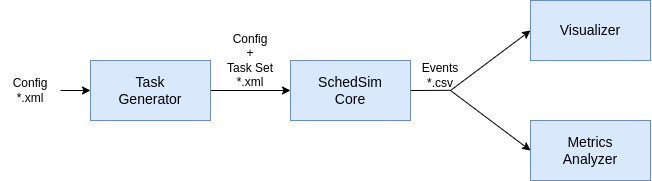
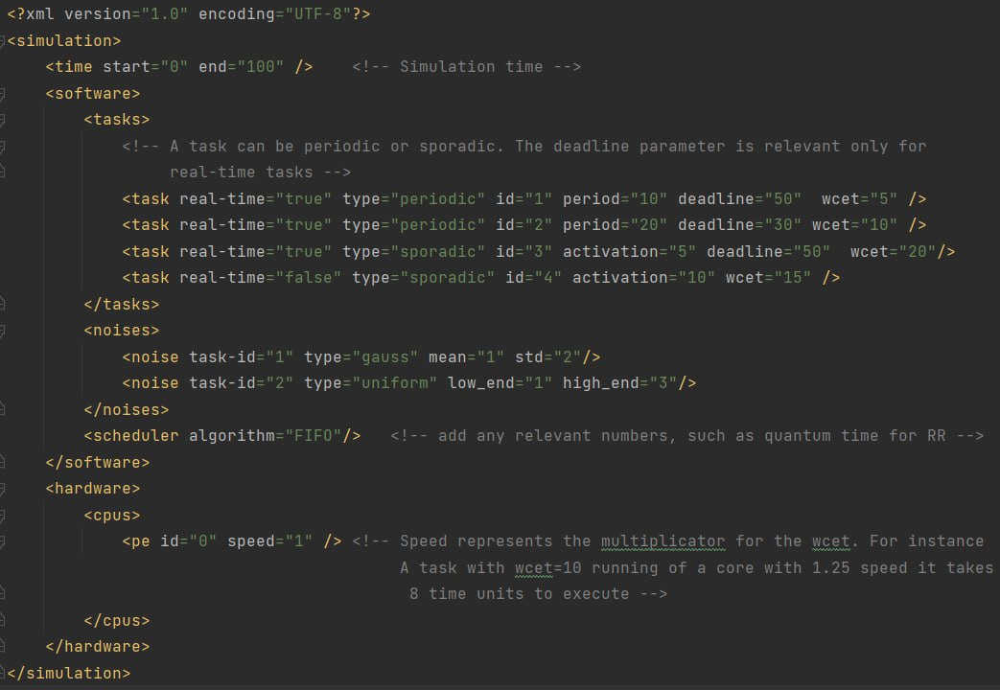

# SchedSim
SchedSim is a collection of tools to test task scheduling algorithm (both real-time and non real-time).
The software is currently under development by [HEAPLab](https://heaplab.deib.polimi.it) students and researchers.

## Features


<p align="center">
  
</p>

## How to run
To run the program, simply run the main giving as arguments your input and output files. A couple of example xml files are present under examples\Inputs.    

Here's an example on how to run it:
```
.../schedsim/main.py examples/Inputs/example_fifo.xml examples/Outputs/fifo_out.txt 
```
### Input options
Here is an example of an input, specifically the FIFO one, which can be found within the examples/Inputs folder.
<p align="center">
  
</p>

* **Tasks** can be added through the _\<tasks>_ tag, within each _\<task>_ tag some options are:
  * **real-time**: a boolean variable to specify whether the task is real-time or not 
  * **deadline**: in case the task is real-time, deadline specifies the time before which its execution must finish
  * **sporadic**: to specify the given task is sporadic, thus has a single activation
  * **activation**: in case the task is sporadic, this specifies the exact time of activation
  * **periodic**: to specify the given task has multiple, periodic, activations
  * **period**: in case the task is periodic, this specifies the frequency of activation (e.g. period =20 means it will activate every 20, 0->20->40...)
  * **wcet**: this specifies the worst case execution time of the task, the time it will take for it to be completed
* **Noises** influence the wcet of a task making it random. They can be added through _\<noises>_ tag. Within it, you must specify the **type** attribute:
  * **uniform**: adds to wcet a value extracted from a uniform distribution having its ends described by the values of the attributes **low_end** and **high_end**
  * **normal**: adds to wcet a value extracted from a gaussian distribution having mean and std defined by the values of the attributes **mean** and **std**
* **Multiprocessor** is handled through the _\<cpus>_ tag, to add processors simply add _\<pe>_ tags and adjust their speed through the **speed** attribute

### Supported algorithms
To run a specific algorithm, insert its initials in the **algortihm** attribute in the _\<scheduler>_ tag. 
Currently supported ones are:
- **FIFO** first in first out
- **EDF** earliest deadline first
- **HRRN** highest response ratio next 
- **SRTF** shortest remaining time first 
- **RR** round robin
- **SJF** shortest job first
- **PFP** partitioned fixed priority
- **PEDF** partitioned edf

Examples inputs for each of them are present within examples\Inputs
## Contributors
- Federico Reghenzani
- Francesco Ratti
- Tomás Droppelmann
- Francesco Dubini
- Alessio Braccini

## License
SchedSim is Open Source and released under the Apache license. See the [LICENSE](./LICENSE) file for further details.
